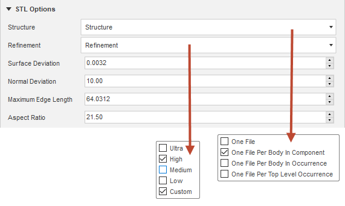
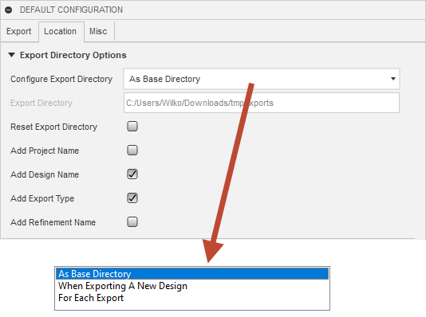
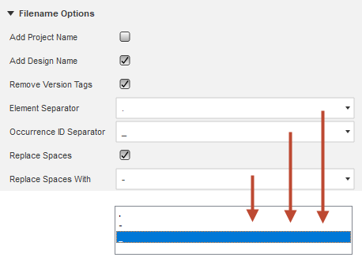

# ExportIt

## Table of content

- [ExportIt](#exportit)
  - [Table of content](#table-of-content)
  - [Summary](#summary)
  - [Export Design Command](#export-design-command)
    - [Basic workflow](#basic-workflow)
  - [Default Configuration Command](#default-configuration-command)
    - [STL Options](#stl-options)
      - [STL Structure](#stl-structure)
      - [STL Refinement](#stl-refinement)
    - [STEP Options](#step-options)
      - [STEP Structure](#step-structure)
    - [Export Directory Options](#export-directory-options)
    - [Filename Options](#filename-options)
      - [Prefix](#prefix)
      - [Filter](#filter)
    - [Version Info](#version-info)
    - [Elements Of The Export Name](#elements-of-the-export-name)
  - [Installation](#installation)
  - [Compatibility](#compatibility)
  - [What's New](#whats-new)
  - [Known Issus](#known-issus)
  - [Wishlist](#wishlist)

## Summary

This add-in exports designs in various resolutions, structures and formats within one run. The advantages compared to the built-in command includes:

- More meaningful and configurable export names.
- EThe export configuration can be saved within the design, which makes it possible to export updated designs again and again at the push of a button.
- Create stl exports with different refinements and structures within one run.
- Avoid export of different occurrences of one component (optional).

## Export Design Command

This command exports the active design (or parts of it) into several formats, structures and refinements in one run. The command is located in the *EXPORTIT*. When the command starts, the user interface displays the [preconfigured default](Default-Configuration-Command) values. These can be adjusted and the changed values (deltas) can be saved in the design.

### Basic workflow

- Open design that should be exported.
- Adjust configuration (if defaults are chosen carefully very minor things have to be adjusted for the every day project).
- Start the export by hitting the *OK* button.
- If the configuration has been changed, the following message appears after the export has been completed:
  
- In the case of *One File Per Body In Occurrence* STL exports, a temporary document must be closed.

## Default Configuration Command

This command allows the definition of the default configuration that is used in the *Export Design* dialog. The commands is located in the workspace *EXPORTIT*.
The user interface is divided into the following sections:

### STL Options

The behavior of STL export is configured in this section. Following options are available:

#### STL Structure

Structures are used to define the granularity of exports.

Option |Description
---------|---------
One File | This structure corresponds to the built-in one and creates one file containing all visible BRep bodies.
One File Per Body In Component | A component can have many occurrences in one design. This option will export each component only once regardless of the number of occurrences. It creates one file per body (or per selected body) in a component. Due to this filter, it will not keep the original position in the 3d space. This structure is e.g useful if a design reuses components and wants to keep the number of exported files small.
One File Per Body In Occurrence | This option corresponds to the integrated *One File Per Body*, but does not create double exports of the same body and works with selected bodis, too. It maintains the positions of the bodies at different occurrences. This structure is useful if the stl files are reassembled at a later point - e.g. in a slicer for multi color / multi material 3d prints.

#### STL Refinement

Refinements can roughly be described as the mesh density of an export. Following refinements are pre-configured.

Option |Description
---------|---------
Low | This option corresponds to the built-in one.
Medium | This option corresponds to the built-in one.
High | This option corresponds to the built-in one.
Ultra | This one is based on the built-in *High* settings, but sets surface deviation to 0.000508mm and normal deviation to 15. This results in a much finer mesh and is great for very detailed geometry or large, roundish objects.

One to many structures or refinements can be selected.

### STEP Options

The granularity of STEP exports is configured in this section.

#### STEP Structure

Option |Description
---------|---------
One File | This structure corresponds to exporting the root component with the built-in function and creates one file containing all visible BRep bodies.
One File Per Component | This function corresponds to exporting a selected component but will create one file per component or selected component.

### Export Directory Options

The export directory and generated subdirectories are defined in this section.

The full path can be composed out of the export directory, the project name and the design name. Three scenarios are useful here:

- Projects with many designs -> A base directory is selected for all projects and the export logic adds the project and design names to create an export structure that corresponds to the data panel structure in Fusion 360.
- Projects with one design -> A base directory is selected for all projects and the export logic adds the project name. This might work with multi design projects too, because the flat structure is still manageable if file options are chosen carefully.
- Individual export directories -> Here the final export directory is selected and no additions are created.

Label | Description | Example
---------|----------|--------
Export Directory | Target directory of the export or base directory of all exports | D:/Google Drive/3d Printing/Fusion 360
Add Project Name | If checked the project name will be added to the export path | D:/Google Drive/3d Printing/Fusion 360/ExportItTest
Add Design Name | If checked the design name will be added to the export path | D:/Google Drive/3d Printing/Fusion 360/ExportItTest/01-Default
Add Export Type | If checked the name of the export type (stl, step) to the export path | D:/Google Drive/3d Printing/Fusion 360/ExportItTest/01-Default/step

### Filename Options

The elements of a filename and how they're connected are configured in this section. More details about the components of the export name can be found [here](Elements-Of-The-Export-Name).

#### Prefix

Prefix are used for better grouping of exports.

Label | Options | Description
---------|----------|---------
Add Project Name |  | Adds the project name as a prefix to the filename.
Add Design Name |  | Adds the design name as a prefix to the filename. This is useful if a project contains several designs and the design name is not part of the export directory (more [here](Export-Directory))

#### Filter 

Filters are used to make filenames more stable, readable or to remove characters that are not supported by the filesystem.

Label | Options | Description | Example
---------|----------|----------|---------
Remove Version Tags |  | Removes the version tags from the design name and linked components. | 01-Default v5 -> 01-Default
Element Separator Tags | . | This options uses a "." (dot) as the separator. | 01-Default.Component.Component.BodyName
Element Separator Tags | - | This options uses a "-" (dash) as the separator. | 01-Default-Component-Component-BodyName
Element Separator Tags | \_ | This options uses a "_" (underscore) as the separator. | 01-Default\_Component\_Component\_BodyName
Occurrence ID Separator | . | This options uses a "." (dot) as the separator. | 01-Default.Component.1.Component.2.BodyName
Occurrence ID Separator | - | This options uses a "-" (dash) as the separator. | 01-Default-Component-1.Component-2.BodyName
Occurrence ID Separator | \_ | This options uses a "_" (underscore) as the separator. | 01-Default\_Component\_1.Component\_2.BodyName

The default setting uses the dot for the element separator and the underscore for the occurrence ID separator and the resulting filenames will look like this:

>01-Default.blocks_1.deep_1.deeper_1.deepest_1.block_5.Body1.stl

### Version Info

This section allows the configuration of the check interval and shows the download URL if an update is available.

Label | Description
---------|---------
Version Check Interval | Defines the polling interval in days. Minimal value = 1, maximal value = 30.
Download URL | This field is only available if a new release can be downloaded.

### Elements Of The Export Name

The export name is composed out of the prefix, the name and the suffix:

Group | Element | Configurable | Description
---------|----------|----------|---------
Prefix | Project name | Yes | Name of the project.
Prefix | Design name | Yes | Name of the design.
Name | Occurrence path | No | Bodies are stored in a component. A component is internally wrapped by an occurrence object. Occurrences can be nested and projects can be organized this way. Depending on the chosen export structure and export format, the export logic can add the occurrence path to a body to the export name.
Name | Body name | No | Depending on the chosen export structure and the export format, the export logic can add the name of the body to the export format.
Suffix | Refinement name | No | If more than one refinement is configured for a STL export, the export logic adds the refinement name to the export name to ensure a unique export name.
Suffix | Export type | No | The system adds always the export type to the export name.

What elements are used depends on the user driven configuration, the export format and the chosen structure. The export logic always tries to make the filename as unique as possible. Even if a filename might be unique in the export directory, it might not be unique anymore in unstructured uploads to e.g. [Thingiverse](https://www.thingiverse.com/), [Cults3d](https://cults3d.com/en) or [PrusaPrinters](https://www.prusaprinters.org/). The logic tries to avoid such conflicts.

Following combinations are defined (elementSeparator = '.' and occurrenceSeparator = '_'):

Export Format | Structure | Elements | Example
---------|----------|----------|---------
 STL | One File | [projectName] + elementSeparator + designName + refinementName + "." + suffix| 01-Default.low.stl
 STL | One File Per Body In Component | [projectName] + elementSeparator + [designName] + elementSeparator + occurrencePathWithoutOccurrenceIDs + elementSeparator + bodyName + elementSeparator + refinementName + "." + suffix | 01-Default.blocks.mixed.bodyInComponentWithSubComponents.low.stl
 STL | One File Per Body In Occurrence | [projectName] + elementSeparator + [designName] + elementSeparator + occurrencePathWithOccurrenceIDs + elementSeparator + bodyName + elementSeparator + refinementName + "." + suffix | 01-Default.blocks_1.deep_1.deeper_1.deepest_1.block_5.Body1.low.stl

## Installation

- Navigate to the add-in directory. Depending on the operating system, they can be found at *%appdata%\Autodesk\Autodesk Fusion 360\API\AddIns* (Microsoft® Windows® 10) or *~/Library/Application Support/Autodesk/Autodesk Fusion 360/API/AddIns* *Apple® macOS™*.
- Download the software from [here](https://github.com/WilkoV/Fusion360_ExportIt/releases) and unpack the downloaded archive.
- Alternatively clone the repository with *git clone --progress -v "https://github.com/WilkoV/Fusion360_ExportIt.git" "ExportIt"*.
- Finish the installation in Fusion 360 by navigating to *Tools->Add-ins->Scripts and Add-ins->Add-ins*, select ExportIt, check *Run on Startup* and press *Run*

## Compatibility

This add-in is developed and tested on a Microsoft® Windows® 10 system but should run on Apple® macOS™ just fine.

## What's New

Version | Date | Description
---------|----------|---------
0.1.0 | 09.07.2020 | Initial version that includes a defaults editor and stl exports that supports different structures and refinements
0.2.0 | 15.07.2020 | Main enhancement is the addition of STEP exports. Additionally basic configuration validation is added.

## Known Issus

- [Updates of the field *Export Directory* are not shown after selecting a directory in the requester.](https://github.com/WilkoV/Fusion360_ExportIt/issues/1)
- [STL exports with the structure "One File Per Body In Occurrence" does not close the temporary document.](https://github.com/WilkoV/Fusion360_ExportIt/issues/2)

## Wishlist

- [x] Defaults editor.
- [ ] Export of selected occurrences.
- [x] Export of selected bodies.
- [x] STEP Exports.
- [ ] F3D Exports.
- [ ] Special refinement for selected bodies that is stored in the project configuration.
- [ ] Export of projects.
- [ ] Selection of stl format (text / binary).
- [ ] Custom refinement.
- [ ] Filename filter to replace spaces with configurable character.
- [x] Configuration validation.
- [ ] Export filter that excludes linked components.
- [ ] Show export summary message after export.
- [ ] Store folded / unfolded state of groups
