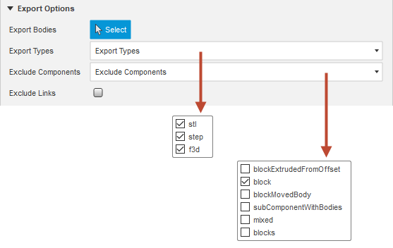
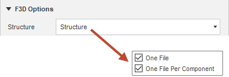

# ExportIt

## Table of content

- [ExportIt](#exportit)
  - [Table of content](#table-of-content)
  - [Summary](#summary)
  - [Export Design Command](#export-design-command)
    - [Basic workflow](#basic-workflow)
    - [Configuration](#configuration)
  - [Default Configuration Command](#default-configuration-command)
    - [Export](#export)
    - [Export Options](#export-options)
      - [STL Options](#stl-options)
      - [STEP Options](#step-options)
      - [F3D Options](#f3d-options)
    - [Location](#location)
      - [Export Directory Options](#export-directory-options)
      - [Filename Options](#filename-options)
    - [Misc](#misc)
      - [Common](#common)
        - [Show Summary](#show-summary)
        - [Auto Save](#auto-save)
      - [Version Info](#version-info)
  - [Elements Of The Export Name](#elements-of-the-export-name)
    - [STL Export Name](#stl-export-name)
    - [STEP Export Name](#step-export-name)
    - [F3D Export Name](#f3d-export-name)
  - [Installation](#installation)
  - [Compatibility](#compatibility)
  - [What's New](#whats-new)
  - [Known Issus](#known-issus)
  - [Wishlist](#wishlist)

## Summary

This add-in exports designs in various resolutions, structures and formats within one run. The advantages compared to the built-in command includes:

- More meaningful and configurable export names.
- The export configuration can be saved within the design, which makes it possible to export updated designs again and again at the push of a button.
- Create stl exports with different refinements and structures within one run.
- Avoid export of different occurrences of one component (optional).

## Export Design Command

This command exports the active design (or parts of it) into several formats, structures and refinements in one run. When the command starts, the user interface displays the [preconfigured default](Default-Configuration-Command) values. These can be adjusted and the changed values (deltas) can be saved in the design.

### Basic workflow

- Open design that should be exported.
- Adjust configuration (if defaults are chosen carefully very minor things have to be adjusted for the every day project).
- Start the export by hitting the *OK* button.
- If the configuration has been changed, the following message appears after the export has been completed:
  
- In the case of _One File Per Body In Occurrence_ or _One File Top Level Occurrence_ STL exports, a temporary document must be closed.

### Configuration

Most parameters correspond to those from the [Default Configuration Command](#default-configuration-command). The one exception is the field _Export Bodies_ that is used to select bodies to limit the exported to a subset of the design. Export formats like STEP or F3D don't support exports of single bodies and will interpret this selection as a selection of a component / occurrence and may contain more than one body.
Not all fields shown in the [Default Configuration Command](#default-configuration-command) are also used in this command.

## Default Configuration Command

This command allows the definition of the default configuration that is used in the *Export Design* dialog. The commands is located in the workspace *EXPORTIT*.

The user interface is divided into the following sections:

### Export

This tab provides all functions to configure what export formats are created and how they're structured.

### Export Options

Export options are top level filters that are applied to STL, STEP or F3D exports.

Label | Option | Description
---------|----------|---------
Export Types | stl | Enables or disables the export of STL files
Export Types | step | Enables or disables the export of STEP files
Export Types | f3d | Enables or disables the export of F3D files
Exclude Components | List of components with bodies | Checked components and including sub-components are not exported. This option will not effect exports with the structure _One File_
Exclude Links | | If checked references to external designs (links) are not exported. This option will not effect exports with the structure _One File_

#### STL Options

The behavior of STL export is configured in this section. Following options are available:

Structures are used to define the granularity of exports.

Option |Description
---------|---------
One File | This structure corresponds to the built-in one and creates one file containing all visible BRep bodies.
One File Per Body In Component | A component can have many occurrences in one design. This option will export each component only once regardless of the number of occurrences. It creates one file per body (or per selected body) in a component. Due to this filter, it will not keep the original position in the 3d space. This structure is e.g useful if a design reuses components and wants to keep the number of exported files small.
One File Per Body In Occurrence | This option corresponds to the integrated *One File Per Body*, but does not create double exports of the same body and works with selected bodies, too. It maintains the positions of the bodies at different occurrences. This structure is useful if the stl files are reassembled at a later point - e.g. in a slicer for multi color / multi material 3d prints.
One File Top Level Occurrence | This option creates one file for each top level occurrence. It's useful if the occurrences are used treated as logical groups like colors or materials and the stl files are reassembled at a later point. In comparison to _One File Per Body In Occurrence_ this option creates less files but needs a special workflow / structure during the design process.

Refinements can roughly be described as the mesh density of an export. Following refinements are pre-configured.

Option |Description
---------|---------
Low | This option corresponds to the built-in one.
Medium | This option corresponds to the built-in one.
High | This option corresponds to the built-in one.
Ultra | This one is based on the built-in *High* settings, but sets surface deviation to 0.000508mm and normal deviation to 15. This results in a much finer mesh and is great for very detailed geometry or large, roundish objects.
Custom | This option enables the definition of surface deviation, normal deviation, maximum edge length and the aspect ratio

Examples:

- Low

- Medium

- High

- Ultra

- Size

One to many structures or refinements can be selected.

#### STEP Options

The granularity of STEP exports is configured in this section.

Structures are used to define the granularity of exports.

Option |Description
---------|---------
One File | This structure corresponds to exporting the root component with the built-in function and creates one file containing all visible BRep bodies.
One File Per Component | This function corresponds to exporting a selected component but will create one file per component or selected component.

One to many structures can be selected.

#### F3D Options

The granularity of F3D exports is configured in this section.

The granularity of STEP exports is configured in this section.

Option |Description
---------|---------
One File | This structure corresponds to exporting the root component with the built-in function and creates one file containing all visible BRep bodies.
One File Per Component | This function corresponds to exporting a selected component but will create one file per component or selected component.

One to many structures can be selected.

### Location

This tab provides all functions to configure the export directory and the filename.

#### Export Directory Options

This section allows the definition of the components of the export directory and when the directory is selected.

The full path can be composed out of the export directory, the project name, the design name and the export type (stl, stp, f3d).

Label | Option | Description | Example
---------|-------|-----------|--------
Configure Export Directory | As Base Directory| This option is useful if all exports (cross-project) normally use a common base directory and the individual projects are separated from each other by the generated directory.| D:/Google Drive/3d Printing/Fusion 360
Configure Export Directory | When Exporting A New Design | This option is useful if cross-project exports do not have a common base directory, but the exports of a design are always saved in the same export directory. | C:/Temp/MySpecialDesign
Configure Export Directory | For Each Export | This option forces the selection of an export directory on each export. | C:/Temp
Reset Export Directory | Checked / Unchecked | If activated, the dialog for selecting a base / export directory is displayed after the _Default Configuration_ command has been closed by pressing _OK_ or by starting an export in the _Export Design_ command. |
Export Directory | Checked / Unchecked| Target directory of the export or base directory of all exports | D:/Google Drive/3d Printing/Fusion 360
Add Project Name | Checked / Unchecked| If checked the project name will be added to the export path | D:/Google Drive/3d Printing/Fusion 360/ExportItTest
Add Design Name |Checked / Unchecked | If checked the design name will be added to the export path | D:/Google Drive/3d Printing/Fusion 360/ExportItTest/01-Default
Add Export Type |Checked / Unchecked | If checked the name of the export type (stl, step) to the export path | D:/Google Drive/3d Printing/Fusion 360/ExportItTest/01-Default/step

#### Filename Options

The elements of a filename and how they're connected are configured in this section.

Following options are used for better grouping of exports.

Label | Options | Description
---------|----------|---------
Add Project Name |  | Adds the project name as a prefix to the filename.
Add Design Name |  | Adds the design name as a prefix to the filename. This is useful if a project contains several designs and the design name is not part of the export directory (more [here](#export-directory-options))

Filters are used to make filenames more (stable e.g. for external versioning), more readable or to remove characters that are not supported by the filesystem.

Label | Options | Description | Example
---------|----------|----------|---------
Remove Version Tags |  | Removes the version tags from the design name and linked components. | 01-Default v5 -> 01-Default
Element Separator Tags | . | This options uses a "." (dot) as the separator. | 01-Default.Component.Component.BodyName
Element Separator Tags | - | This options uses a "-" (dash) as the separator. | 01-Default-Component-Component-BodyName
Element Separator Tags | \_ | This options uses a "_" (underscore) as the separator. | 01-Default\_Component\_Component\_BodyName
Occurrence ID Separator | . | This options uses a "." (dot) as the separator. | 01-Default.Component.1.Component.2.BodyName
Occurrence ID Separator | - | This options uses a "-" (dash) as the separator. | 01-Default-Component-1.Component-2.BodyName
Occurrence ID Separator | \_ | This options uses a "_" (underscore) as the separator. | 01-Default\_Component\_1.Component\_2.BodyName
Replace Spaces | True / False | This option enables the replacement of spaces in the filename. | 08-ReplaceSpaces.just-a-block_1.Body1.low.stl
Replace Spaces With | . | This options uses a "." (dot) as a replacement. | 08-ReplaceSpaces.just.a.block_1.Body1.low.stl
Replace Spaces With | - | This options uses a "-" (dash) as a replacement. |  08-ReplaceSpaces.just-a-block_1.Body1.low.stl
Replace Spaces With | \_ | This options uses a "_" (underscore) as a replacement. |  08-ReplaceSpaces.just\_a\_block_1.Body1.low.stl

More details about the components of the export name can be found [here](#elements-of-the-export-name).

### Misc

This tab provides various functions to configure the general behavior of the add-in or the UI

#### Common

This section provides functions to configure the behavior of the UI and the add-in

##### Show Summary

Like for logging levels, this parameter controls what level of messages are shown in the summary message at the end of an export.

Level | Description
---------|---------
Info | Information are created for successfully created exports. If this level is activated warnings and errors are also shown.
Warning | Warning are created if a f3d export contains references (links) to external designs. If this level is activated errors are shown, tool.
Error | Errors are created if an export fails.

##### Auto Save

If _Auto Save_ is enabled and the configuration is changed, the active document will be saved to store the embedded _ExportIt project configuration_. The _Auto Save Message_ will be applied as a version description.

#### Version Info

This section allows the configuration of the check interval and shows the download URL if an update is available.

Label | Description
---------|---------
Version Check Interval | Defines the polling interval in days. Minimal value = 1, maximal value = 30.
Download URL | This field is only available if a new release can be downloaded.

## Elements Of The Export Name

The export name is composed out of the prefix, the name and the suffix.

Group | Element | Configurable | Description
---------|----------|----------|---------
Prefix | Project name | Yes | Name of the project.
Prefix | Design name | Yes | Name of the design.
Name | Occurrence path | No | Bodies are stored in a component. A component is internally wrapped by an occurrence object. Occurrences can be nested and projects can be organized this way. Depending on the chosen export structure and export format, the export logic can add the occurrence path to a body to the export name.
Name | Body name | No | Depending on the chosen export structure and the export format, the export logic can add the name of the body to the export format.
Suffix | Refinement name | No | If more than one refinement is configured for a STL export, the export logic adds the refinement name to the export name to ensure a unique export name.
Suffix | Export type | No | The system adds always the export type to the export name.

What elements are used depends on the user driven configuration, the export format and the chosen structure. The export logic always tries to make the filename as unique as possible. Even if a filename might be unique in the export directory, it might not be unique anymore in unstructured uploads to e.g. [Thingiverse](https://www.thingiverse.com/), [Cults3d](https://cults3d.com/en) or [PrusaPrinters](https://www.prusaprinters.org/). The logic tries to avoid such conflicts.

Following combinations are defined (elementSeparator = '.', occurrenceSeparator = '\_', projectName = False, removeVersionTag = True):

### STL Export Name

Structure | Elements | Example
---------|----------|---------
One File | [projectName] + elementSeparator + designName + refinementName + "." + suffix| 01-Default.low.stl
One File Per Body In Component | [projectName] + elementSeparator + [designName] + elementSeparator + occurrencePathWithoutOccurrenceIDs + elementSeparator + bodyName + elementSeparator + refinementName + "." + suffix | 01-Default.blocks.mixed.bodyInComponentWithSubComponents.low.stl
One File Per Body In Occurrence | [projectName] + elementSeparator + [designName] + elementSeparator + occurrencePathWithOccurrenceIDs + elementSeparator + bodyName + elementSeparator + refinementName + "." + suffix | 01-Default.blocks_1.deep_1.deeper_1.deepest_1.block_5.Body1.low.stl
One File Per Top Level Occurrence | [projectName] + elementSeparator + [designName] + elementSeparator + topLevelOccurrenceWithOccurrenceIDs + elementSeparator + refinementName + "." + suffix | 08-TopLevelComponentsAsOneFile.green_2.low.stl

### STEP Export Name

Structure | Elements | Example
---------|----------|---------
One File | [projectName] + elementSeparator + designName + suffix| 01-Default.step
One File Per Component | [projectName] + elementSeparator + [designName] + elementSeparator + occurrencePathWithoutOccurrenceIDs + suffix | 01-Default.blocks.mixed.step

### F3D Export Name

Structure | Elements | Example
---------|----------|---------
One File | [projectName] + elementSeparator + designName + suffix| 01-Default.f3d
One File Per Component | [projectName] + elementSeparator + [designName] + elementSeparator + occurrencePathWithoutOccurrenceIDs + suffix | 01-Default.blocks.mixed.f3d

## Installation

- Navigate to the add-in directory. Depending on the operating system, they can be found at *%appdata%\Autodesk\Autodesk Fusion 360\API\AddIns* (Microsoft® Windows® 10) or *~/Library/Application Support/Autodesk/Autodesk Fusion 360/API/AddIns* *Apple® macOS™*.
- Download the software from [here](https://github.com/WilkoV/Fusion360_ExportIt/releases) and unpack the downloaded archive.
- Alternatively clone the repository with *git clone --progress -v "https://github.com/WilkoV/Fusion360_ExportIt.git" "ExportIt"*.
- Finish the installation in Fusion 360 by navigating to *Tools->Add-ins->Scripts and Add-ins->Add-ins*, select ExportIt, check *Run on Startup* and press *Run*

## Compatibility

This add-in is developed and tested on a Microsoft® Windows® 10 system but should run on Apple® macOS™ just fine.

## What's New

Version | Date | Description
---------|----------|---------
0.1.0 | 09.07.2020 | Initial version that includes a defaults editor and stl exports that supports different structures and refinements.
0.2.0 | 15.07.2020 | Main enhancement is the addition of STEP exports. Additionally basic configuration validation is added.
0.3.0 | 21.07.2020 | Main enhancement is the addition of F3D exports. Additionally a progress dialog is shown on larger exports and a summary message is shown at the end of an export.
0.4.0 | 22.07.2020 | UI cleaned up by adding _Export_, _Location_ and _Misc_ tabs. Filename filter added to remove spaces from filenames. Export filter added that prevents linked components to be exported.
0.5.0 | 04.08.2020 | A checkbox is added that allows to reset the base directory / export directory after closing the _Default Configuration_ command with the _OK_ button or by starting an export in the _Export Design_ command. The new workflow closes the issue #1 and the new checkbox closes the enhancement #8. In addition, the concept of the export directory is no longer based only on the idea of ​​a standard / base directory. It can now be better adapted to different workflows by enabling the configuration of a base directory or the configuration of the export directory when exporting a new design for the first time, or by having to configure the export directory every time an export is triggered. The new options close the enhancement #7.
0.6.0 | 15.08.2020 | Some artists use top-level components to group bodies or sub-components by color or material. These groups are then also used for the final STL export. The new STL option _One File Top Level Occurrence_ complies with these exports. Documentation slightly enhanced.
TODO 0.7.0 | XX.08.2020 | _Custom_ STL refinements added in case the predefined refinements _Low_, _Medium_, _High_ and _Ultra_ do not match the use case. _Exclude Components_ filter added to the _Export Options_. In contrast to the selection filter _Export Bodies_, this filter is saved in the project configuration and used for every export of the design. Useful for imported subassemblies that don't maintain the link (broken) anymore. This closes the enhancement #13. Referenced sub-assemblies are now handled correctly, if "Exclude Links" is activated. This fixes issue #12

## Known Issus

- [STL exports with the structure "One File Per Body In Occurrence" does not close the temporary document.](https://github.com/WilkoV/Fusion360_ExportIt/issues/2)

## Wishlist

- [ ] Export of selected occurrences.
- [ ] Special refinement for selected bodies that is stored in the project configuration.
- [ ] Export of projects.
- [ ] Selection of stl format (text / binary).
- [x] Defaults editor.
- [x] Export of selected bodies.
- [x] STEP Exports.
- [x] F3D Exports.
- [x] Configuration validation.
- [x] Show export summary message after export.
- [x] Show progress dialog
- [X] Cleaner user interface
- [x] Add auto save option for changed configuration
- [x] Filename filter to replace spaces with configurable character.
- [x] Export filter that excludes linked components.
- [x] Custom stl refinement.
